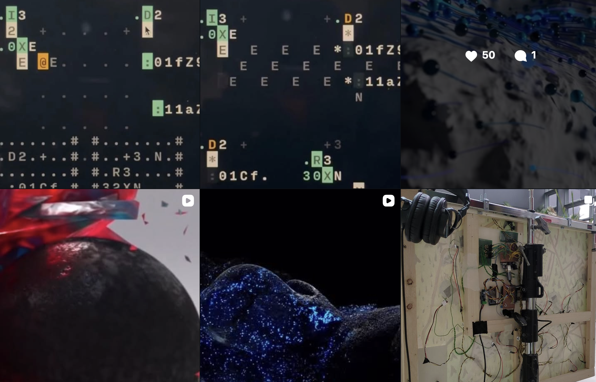
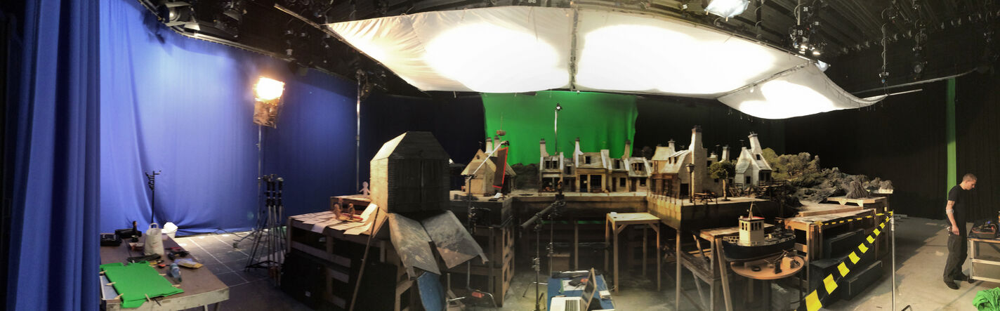

name: inverse
layout: true
class: center, middle, inverse
---

#### Workshop
## Designing Translational Media and World-Building

 

### Introductions

 
### Prof. Dr. Lena Gieseke | l.gieseke@filmuniversitaet.de  

#### Film University Babelsberg KONRAD WOLF

???

Translation is not transfer. When you turn gesture, data, sound, or space into computation, you have to decide what to measure, what to filter out, and how to structure it. The result is not a copy of reality but a new computational system that follows its own rules and shapes how people can interact with it. Translation creates a third space, a constructed environment with specific possibilities and limits.

For example, when a dancer’s movement is translated into a particle field that swirls and accumulates, the system is not simply showing the dance. It produces a dynamic environment with its own behavior rather than an exact representation of the dancer’s motion.

---
layout: false

.center[].imgref[[Image: Rafik Anadol. 2021. Machine Hallucinations — Nature Dreams. https://refikanadol.com/works/machine-hallucinations-nature-dreams/]]

---

.center[].imgref[[Image: Memo Akten and Katie Hofstadter. 2025. Superradiance. https://superradiance.net/]]

---

.center[] .imgref[[Image: [Martin J. Levy](https://blog.cloudflare.com/randomness-101-lavarand-in-production/)]]

---
.header[Workshop Designing Translational Media and World-Building]
## Workshop

--

.left-even[
Monday, March 9 | 15:00–18:30  
*Translational Pipelines — Constructing Third Spaces*  

* Introductions
* Lecture Translational Media
* Cataloging Translations and Spaces
* Group Work
]

???

* 15:00–15:15 Introductions
* 15:15–16:30 Lecture Translational Media
    * Source → Capture → Transform → Third Space
    * Translation constructs new spaces
    * Examples
* 16:30–16:45 Break
* 16:45–17:45 Cataloging Translations and Spaces
* 17:45–18:30 Group Work 
    * Each group develops one translational scenario for a setup, design, or artwork. 

--
.right-even[

Wednesday, March 11 | 9:00–13:30  
*From Pipeline to World — Analysis and Consequences* 

* Group Work
* Micro-Presentations
* Synthesis and Outlook Discussion
* Wrap-up

]

???

Theme: From Pipeline to World — Analysis and Consequences 

* 9:00–10:00 Group Work
* 10:00–10:15 Break
* 10:15–11:45 Micro-presentations (~5 min/group)
* 11:45–12:00 Break
* 12:45–13:15 Synthesis and Outlook Discussion
* 13:15–13:30 Wrap-up

---
template:inverse

# Introductions

---
## Who am I?

--

* Bachelor in Computer Science (Vordiplom)
* Master in Fine Art (MFA Dramatic Media)
* 6 years in the industry (VFX, R&D, Software Development)
* Phd in Computer Science (Dr. rer. nat. Computer Graphics)

--

 

* Film University Babelsberg KONRAD WOLF, Potsdam, Germany
* Professor for Image-based Media Technologies
* MA Creative Technologies

---
## MA Creative Technologies

> Computer Science meets Creativity, Art & Film...

--

.center[]  

[Filmuni Website ⇗](https://www.filmuniversitaet.de/en/studies/study-programs/master-programs/creative-technologies)

---
## MA Creative Technologies

> Computer Science meets Creativity, Art & Film...

.center[]  

[Instagram: ctech.filmuniversity ⇗](https://www.instagram.com/ctech.filmuniversity/)

---
## Film University Babelsberg KONRAD WOLF

--

* Largest film school in Germany (established 1954), now public university

--

* About 100 in-house film productions yearly

--

* State-of-the-art equipment and environments (2 studios, 150 and 300 sqm)

.center[ .imgref[[Image: [Filmuni](https://www.filmuniversitaet.de/filmuni/gebaeude-infrastruktur/studios-und-technik)]]]

???
* e.g., Sony F55, ARRI Alexa, Panasonic VariCam, Harrison MPC4D console with Dolby Atmos
* ceiling lighting rigs

---
## Film University Babelsberg KONRAD WOLF

.left-quarter[
Neighbor: Babelsberg Film Studio, oldest large-scale film studio in the world, producing films since 1912.
]
.right-quarter[ .imgref[[Image: [Studio Babelsberg](https://www.metropolitanbacklot.com/galerie/)]]]

???
* Hundreds of films, including Fritz Lang's Metropolis and Josef von Sternberg's The Blue Angel were filmed there. More recent productions include V for Vendetta, Captain America: Civil War, Æon Flux, The Bourne Ultimatum, Valkyrie, Inglourious Basterds, Cloud Atlas, The Grand Budapest Hotel, The Hunger Games, Isle of Dogs and The Matrix Resurrections. 

---
template:inverse

### *How about you?*
