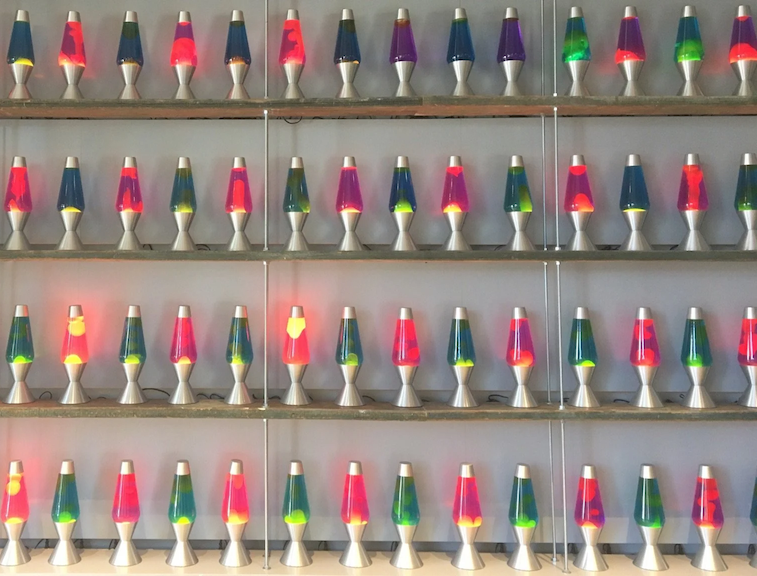
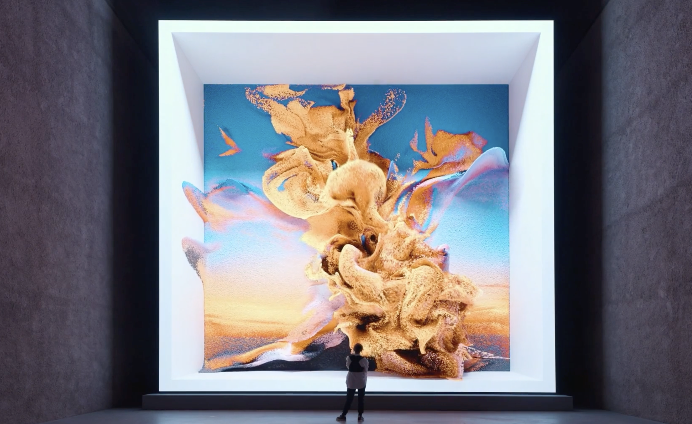
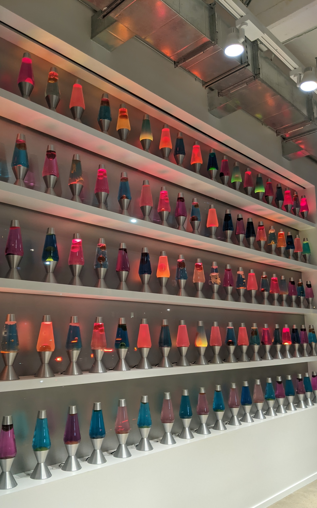
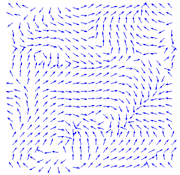
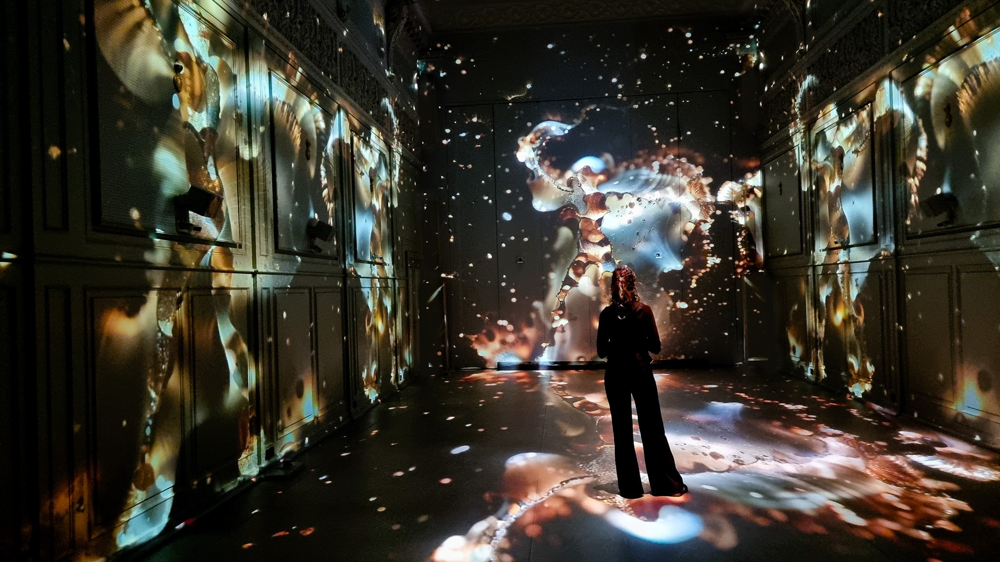

name: inverse
layout: true
class: center, middle, inverse
---

#### From Gesture to Code to Space:
## Designing Translational Media and World-Building

 

### Lecture

 
### Lena Gieseke | l.gieseke@filmuniversitaet.de  

#### Film University Babelsberg KONRAD WOLF

???

  
First assumption: we are moving from the analog world into the digital one

* What happens when we do so?

* Goal: Give a usable mental model for how pipelines translate analog phenomena into computational worlds. 

.center[] .imgref[[Image: [Martin J. Levy](https://blog.cloudflare.com/randomness-101-lavarand-in-production/)]]

.center[].imgref[[Image: Rafik Anadol. 2021. Machine Hallucinations — Nature Dreams. https://refikanadol.com/works/machine-hallucinations-nature-dreams/]]

.center[].imgref[[Image: Memo Akten and Katie Hofstadter. 2025. Superradiance. https://superradiance.net/]]

---
template: inverse

### *Media translation is not just copying the world.* 

--

### *It creates a new space with its own logic.*

???
* Translation is not transfer. It produces a third space with its own rules and consequences.
* Computational translation constructs new spaces with their own rules.

Computational representations are new spaces, **not copies**.  

* Translation as aesthetic transformation
* Translation as design choice
* Translation as world-building
* What gets lost, amplified, stylized, or made perceptible
* That space can shape perception and behavior in the world.
  

For art and design students, repeatedly foreground:
* what is selected
* what is discarded
* what is abstracted
* what becomes material
* what becomes atmosphere

---
template: inverse

### *Designing those spaces is world-building.*

???
Therefore, translation is not neutral.

Pipeline design for computational translation is **world-building**, not just engineering and it is not a neural act.

---
layout:false

## Lecture

--

* What translation means

--

* How translation creates a third space

--

* Three examples

--

    * Example: Gesture → Fields  
    * Example: Data → Fields  
    * Example: Gesture & Data → Fields  
  
--

* Why this is world-building

???
"it is a working theory, useful in many systems".

* Goal: Give a usable mental model for how pipelines translate phenomena into computational worlds. 
* Thesis: translation is not transfer. It produces a third space with its own rules and consequences.

----

SECTION:

---
template:inverse

# Translation

---
## Translation

--

A pipeline that

--
* captures or encodes a real-world phenomenon

???
Capture is the moment where a phenomenon is measured or sensed. A device samples something from the world.
* Examples: camera → light, microphone → air pressure, motion capture → body movement, sensor → temperature
* Capture is still close to physics. It produces raw signals.

Encoding is what happens next. The signal is converted into a structured representation the system can work with.
* Examples: pixels in an image matrix, skeleton joint coordinates, feature vectors from a neural network, tokens in a language model
* Encoding introduces choices and abstractions. It decides what counts as signal and what disappears.

A simple way to think about it:
* capture → measurement
* encoding → representation

--
* transforms it via an algorithmic model

???
An algorithmic model is the set of rules that determines how the captured data is processed and turned into something new. It defines how the system interprets the input and what kinds of structures or behaviors can appear in the resulting space.
    
The key point is that the system does not simply display the captured data. The model transforms it according to its own logic.

--
* into a *third space* with a new structure.

???
We translate behavior into signals, signals into models, models into spaces.
The result belongs fully to neither side.

In short what to analyse or design...

(The same as last slides just shorter)

--

 

Source →  

--

* Capture / Encode →  

???
Example with motion capture:

body movement  
→ cameras detect markers (capture)  
→ software computes joint coordinates (encoding)  
→ simulation uses them as forces or parameters  

Some pipelines expose both steps, others collapse them. For instance:
* a depth camera clearly separates sensing and representation
* a neural network feature extractor both captures patterns and encodes them in one step

--

* Model / Transform →  

???
If a dancer’s movement is captured as joint coordinates, a model might
* drive a fluid simulation, turning motion into swirling currents
* control a particle system, producing trails and fields
* feed a machine learning model, generating new images or sounds

The model therefore decides what the data becomes: Movement might become paint, wind, light, or entirely new imagery.

In that sense, the algorithmic model is the engine of the translation. It defines the rules of the new space that emerges from the data.

--
  
Third space 

???

For example, when a dancer’s movement is translated into a particle field that swirls and accumulates, the system is not simply showing the dance. It produces a dynamic environment with its own behavior rather than an exact representation of the dancer’s motion.

Examples:
- body → tracking → simulation → field
- building → segmentation → graph → navigable model
- data → embedding → synthesis → environment

---
.header[Translation | From World to Algorithmic Space]

.center[ ] .imgref[[Images: [By HaeB - Own work, CC BY-SA 4.0](https://commons.wikimedia.org/w/index.php?curid=116926170), [Martin J. Levy](https://blog.cloudflare.com/randomness-101-lavarand-in-production/)]]

.footnote[[Walmsley, Alexander. 2026. Live Stream.]]

???
A simple translation with surprising stakes. This is the "hello world" of third spaces, bringing something from the real world into computation.

* Context: the generation of random numbers
* Relevant for the generation of secure cryptographic keys to the random initialising of weights during the training of an AI network.
* Computers cannot produce true randomness.
    * They simulate it using deterministic algorithms — pseudo-random number generator (PRNG) — and that simulation is structurally different from the thing it mimics
    * PRNGs has period lengths, statistical biases, seeds.
    * deterministic: determined solely by the input and initial conditions, thereby always returning the same results
* Increasingly true random number generators (TRNG), make use chaotic physical processes in the real world, 
    * like atmospheric noise (https://www.random.org/) or radioactive decay (https://www.fourmilab.ch/hotbits/)
    * practically impossible to predict using an algorithm

---
.header[Translation | From World to Algorithmic Space]

.center[ ] .imgref[[Images: [By HaeB - Own work, CC BY-SA 4.0](https://commons.wikimedia.org/w/index.php?curid=116926170), [Martin J. Levy](https://blog.cloudflare.com/randomness-101-lavarand-in-production/)]]

.footnote[[Walmsley, Alexander. 2026. Live Stream.]]

???

* And that is what we are seeing here
* In the San Francisco offices of the internet security firm CloudFlare there is a wall of lava lamps filmed 24 hours a day in order to provide cryptographic keys for some 20% of the world’s internet traffic.
* Known as the Lavarand, whenever a key is required, the CloudFlare systems translate a frame from the live feed into a numeric value that is then fed as a seed into a PRNG, generating the key.
* Due to the highly chaotic movement of the liquid in the lamps, as well as the atmospheric and lighting conditions that eventually become rendered as pixels in the image, the seeds are extremely difficult to predict. 

Despite the use of brightly coloured objects made for human entertainment, the translation is purely operational for the computational process of pseudo-random number generation.

------

In such cases, a PRNG is often initialised with a truly random seed in order to quickly and efficiently produce a random key. In the San Francisco offices of the internet security firm CloudFlare there is a wall of lava lamps filmed 24 hours a day in order to provide cryptographic keys for some 20% of the world’s internet traffic (Fig. 1). Known as the Lavarand, the idea is based on an original patent by the US company Silicon Graphics in 1996 (Noll *et al.,* 1996). Whenever a key is required, the CloudFlare systems translate a frame from the live feed into a numeric value that is then fed as a seed into a PRNG, generating the key (Leebow-Fieser, 2017). Due to the highly chaotic movement of the liquid in the lamps, as well as the atmospheric and lighting conditions that eventually become rendered as pixels in the image, the seeds are extremely difficult to predict. The images, despite their use of brightly coloured objects made for human entertainment, are made to be purely operational for the computational process of pseudo-random number generation.

Random numbers play a key role in computational processes ranging from the generation of secure cryptographic keys to the random initialization of weights during AI network training. Yet computers cannot produce true randomness. They simulate it using deterministic algorithms — PRNGs — and that simulation is structurally different from the thing it mimics. It has period lengths, statistical biases, seeds. In other words, the move from real-world phenomenon to computational representation is not a neutral transfer. Something changes in the crossing.
* One response to this problem is to extract seeds from highly complex physical processes. True random number generators (TRNGs) draw on the latent entropy in chaotic physical phenomena: atmospheric noise, radioactive decay, or — perhaps most evocatively — lava lamps. In the San Francisco offices of the internet security firm Cloudflare, a wall of lava lamps is filmed around the clock, providing cryptographic keys for roughly 20% of the world's internet traffic. Known as Lavarand, the system translates frames from the live feed into numeric seeds for a PRNG. The lamps' chaotic fluid motion, combined with atmospheric and lighting conditions, makes the seeds practically impossible to predict algorithmically. Objects designed purely for human visual pleasure become, in this context, operational instruments for computation.

* https://blog.cloudflare.com/randomness-101-lavarand-in-production/
  

This distinction is particularly salient in the area of cryptography, which is involved in the study of securing communication across networks (Rivest, 1990). The security of the world’s internet traffic relies to a large extent on the ability to generate cryptographic keys with a degree of unpredictability high enough to make them difficult if not practically impossible to guess. In such cases, a PRNG is often initialised with a truly random seed in order to quickly and efficiently produce a random key. In the San Francisco offices of the internet security firm CloudFlare there is a wall of lava lamps filmed 24 hours a day in order to provide cryptographic keys for some 20% of the world’s internet traffic (Fig. 1). Known as the Lavarand, the idea is based on an original patent by the US company Silicon Graphics in 1996 (Noll *et al.,* 1996). Whenever a key is required, the CloudFlare systems translate a frame from the live feed into a numeric value that is then fed as a seed into a PRNG, generating the key (Leebow-Fieser, 2017). Due to the highly chaotic movement of the liquid in the lamps, as well as the atmospheric and lighting conditions that eventually become rendered as pixels in the image, the seeds are extremely difficult to predict. The images, despite their use of brightly coloured objects made for human entertainment, are made to be purely operational for the computational process of pseudo-random number generation.

---
.header[Translation]

## Lavarand

Pipeline: Source →  Capture / Encode →  Model / Transform → Third space 

--

 

--

* **Source**: Chaotic physical process (fluid, light, temperature)  

--

* **Capture**: Camera records images → pixel values  

--

* **Transform**: Pixel values are converted into a numerical seed for a random number generator

--

* **Third space**: A stream of pseudo-random numbers used by computational systems

???
After the camera captures the lava lamps, you have a large array of pixel values. That image contains physical entropy, but in a messy, structured form.

In the transform step, the system first extracts the raw pixel data and converts it into a binary string. Then it runs that data through a cryptographic hash function, such as SHA-256. A hash function deterministically maps any input to a fixed-length output and spreads small differences widely across the result. This helps remove bias and produce a uniformly distributed bitstring.

That resulting bitstring becomes the seed for the pseudo-random number generator. The hash does not create randomness. It reorganizes physical entropy into a clean numerical form that a PRNG can use.

* Computers simulate randomness, but we import entropy from real-world physics as seeds.
* The "randomness" we get is neither purely real-world based, nor purely computational
* It is a new operational space.
   

----

SECTION:

---
template:inverse

# The Third Space

---
## The Third Space

--

The space that the computational system generates based on the given pipeline.

--

* It might have its own rules and behaviors

--

* It might affect its environment, e.g. the analog space

--
 

> Not the physical source. Not a mere digital copy.

???
* Think of it this way: When you simulate fluid, you do not have water. But you do not have a picture of water either. You have a system with viscosity, diffusion, attractors. That is the third space.

* It is where the translation lives...

* It is computational, but it behaves. And behavior is ontology.

---
## The Third Space

???
Before we look at more examples, we need a way to describe and compare third spaces.
Not all of them behave in the same way. Some are built for systems, others for humans. Some are tightly controlled, others produce open-ended behavior.

To make that difference more understandable, we can position them along two continuous dimensions.

If we take the third space seriously as a model-generated world, then we need criteria to evaluate it. Not in terms of taste, but in terms of behavior, consequence, and meaning.

--

Two continuous dimensions describing the *type* of the third space:

--

 
  
- **Operational** (used by systems) ↔ **Experiential** (lived by humans)

???
Operational: used by systems (security, robots, infrastructure).
Experiential: lived by humans (interaction, perception, art).

--
- **Fixed** (mostly predictable) ↔ **Generative** (open-ended outcomes)

???
Fixed systems produce the same outcome given the same input.  
  
Fixed / Deterministic systems produce the same outcome given the same input, whereas generative systems can produce multiple possible outcomes and unfold in ways that are not fully predictable in advance.

* Deterministic means repeatable mapping
* Generative means the system can develop new states beyond a fixed input–output pattern.
* Deterministic: determined solely by the input and initial conditions, thereby always returning the same 

In the following, we will mainly consider *experiential* translations.

---
## The Third Space

Three properties describing how the third space *works*:

--

* **System Setup**
    * What entities and rules arise
    * What the system can produce over time

--

> Does the translation introduce structures or dynamics that did not exist in the source?

--

→ Structural and dynamic difference

???

System setup describes how the translated world is constructed.

It includes the entities, parameters, and rules that define the system,
and the kinds of states the system can produce.

Example: fluid simulation

Setup:
* velocity field
* viscosity parameter
* diffusion rule

From this setup, patterns such as vortices, turbulence, and evolving flows can appear.

The key question becomes:
does the translation create a system capable of producing states the original source could not produce?

---

## The Third Space

Three properties describing how the third space *works*:

--

* **Influence (feedback)**
    * The system acts back on the source domain  
    * It changes behavior, decisions, practices, or perception outside of the system  

--

> Does the translation alter what it translates?

--

→ Behavioral difference

---

## The Third Space

Three properties describing how the third space *works*:

* **Meaning (interpretation)**
  * Semantic resonance
  * A coherent conceptual claim

--

> Does the system influence our understanding (of the source)?

--

→ Interpretive difference

???
The model does not only represent the source — it reorganizes it.

Influence / Behavioral difference
* *How strongly does it reshape the source domain?*

* At first, the body drives the field.
* The gesture injects velocity into the simulation.
* But once the field develops vortices and currents, the dancer starts responding to those patterns.
* They move differently because of what the fluid does.

Behavioral difference is about what people or systems do differently because the third space exists.
Interpretive difference is about how people understand or conceptualize the source differently.

* A navigation map changes how pedestrians walk.
* A social media ranking changes what users post.
* A fluid field changes how a dancer moves.

We could score per item: 0 (weak), 1 (some), 2 (strong)

Difference in Meaning
* *How strongly does it reframe our understanding (of the source)?*

Behavioral difference is about what people or systems do differently because the third space exists.
Interpretive difference is about how people understand or conceptualize the source differently.

* A navigation map changes how pedestrians walk.
* A social media ranking changes what users post.
* A fluid field changes how a dancer moves.

---
## The Third Space

* System Setup
* Influence
* Meaning

--

 

> The more strongly these properties changed and present, the more the translation functions as world building.

???

...rather than mere representation.

- This is not about “beauty.”
- It is about whether the translation means something structurally, not just aesthetically.
- Does the mapping itself carry an argument?

---
.header[The Third Space of Lavarand]

.center[] .imgref[[Images: [Code Golf - Simplistic Lava Lamp](https://codegolf.stackexchange.com/questions/171984/simplistic-lava-lamp)]]

---

## The Third Space of Lavarand

- Operational ↔ Experiential? Operational ✓
- Deterministic ↔ Generative? Deterministic ✓

???
It operates as infrastructure.

If:
* the captured image is identical
* the hash function is identical
* the PRNG algorithm and state are identical.

Because capturing the exact same physical configuration of lava lamps twice is astronomically unlikely, the seed changes constantly.
* So the system is practically unpredictable.

Lavarand is deterministic in its rule, stochastic in its input, and unpredictable in practice, but not generative in the structural sense.

* Given the same seed, it produces the same sequence.
* Unpredictability comes from physical entropy at the input, not from internal generative dynamics.

This demonstrates that even purely operational,
deterministic systems produce consequential third spaces.

---

## The Third Space of Lavarand

* Structural and dynamic difference
* Behavioral difference
* Interpretive difference

---

## The Third Space of Lavarand

* Structural and dynamic difference: **some**
    * Introduces algorithmic entities (seed, state, recurrence rule) and statistical properties (distribution, period)
    * Produces an effectively unbounded sequence
    * Does not alter or expand its internal rule system
* Behavioral difference
* Interpretive difference

---

## The Third Space of Lavarand

* Structural and dynamic difference: **some**
* Behavioral difference: **strong**
    * Shapes cryptographic systems and global communication infrastructure
* Interpretive difference

---

## The Third Space of Lavarand

* Structural and dynamic difference: **some**
* Behavioral difference: **strong**
* Interpretive difference: **weak**
    * Instrumental rather than interpretive
    * No conceptual claim
    * Does not reorganize how we understand randomness

---

## The Third Space of Lavarand

* Structural and dynamic difference: **some**
* Behavioral difference: **strong**
* Interpretive difference: **weak**

> Lavarand transforms liquid motion into cryptographic infrastructure: a mathematically structured world that governs security, yet remains purely instrumental.

???
Lavarand produces an operational third space: algorithmically structured and highly generative in its output, globally influential as infrastructure, yet weak in semantic resonance because it functions instrumentally rather than conceptually.

This matters: Lavarand is powerful but not "artful" in itself.
It does not reorganize how we understand randomness experientially. It instrumentalizes it.

---

template: inverse
### Example
# Gesture → Fields

???
We have described the third space in abstract terms: a model-generated world with its own entities, dynamics, influence, and meaning. That can sound theoretical. So let us ground it in something immediate.

What happens when we translate the human body?

We now move into spaces that can be inhabited, played, and felt.
The key shift is not prettier output. It is new rules.

---

.center[].imgref[[Images: [giphy](https://giphy.com/stickers/originals-dancing-3ohhwxtchVEHfSPj0c)]]

???
* What happens when we translate the human body?
* Technically, we can capture kinematics: joints, velocities, trajectories.
* But is that enough for a third space that aims to be meaningful?

Movement is not only displacement in space. It carries intention, emotion, and context. When we translate a body computationally, we risk reducing expression to coordinates.

Those layers of significance beyond pure joint transformations are what we call gestures. And it is precisely in translating gesture, not just motion, that artistic third spaces become interesting.

---
## Body Capture Cheat Sheet

Marker-based
* Optical mocap (Vicon, OptiTrack)
* Inertial mocap (Xsens, Rokoko)

Markerless
* Depth sensors (LiDAR, structured light, e.g. Azure)
* Multi-camera volumetric
* Video-based pose estimation (ML-driven, MediaPipe, OpenPose)

???
CS lens: these are different sensor models with different error profiles.
Noise is not a bug. It changes the third space.

Inertial motion capture (inertial mocap) tracks body movement using small wearable sensors instead of cameras.
* The performer wears a suit with IMUs (Inertial Measurement Units). Each IMU contains:
    * an accelerometer (measures acceleration)
    * a gyroscope (measures rotation)
    * often a magnetometer (measures orientation relative to Earth’s magnetic field)

Optical mocap sees the body from outside. Inertial mocap feels the body from inside.

---
## Body Capture Technologies

.center[ ] .imgref[[Images: [University of Eastern Finland, HUMEA lab](https://sites.uef.fi/humea/humea-laboratory/human-motion-and-performance-analysis/)]]

---

.center[
 <video width="1060" controls>
  <source src="./img/spaces/majorlazer_01.webm" type="video/mp4">
</video> 
]

.footnote[[Major Lazer – Light it Up (feat. Nyla & Fuse ODG)](https://www.youtube.com/watch?v=r2LpOUwca94)]

---
## The Third Space of *Light It Up*

- Operational ↔ Experiential? Experiential ✓

???

The output is designed for perception and cultural consumption.
It is not infrastructure. It is aesthetic media.
The third space is primarily lived through viewing.

It demonstrates translation as stylistic transformation rather than system-level world-building.

--
- Deterministic ↔ Generative: Deterministic  ✓

???
* The motion capture data is recorded.
* The retargeting process maps joints to another rig.
* The choreography does not evolve dynamically.

There is transformation, but not open-ended production.
This is a controlled translation, not a generative system.

---
## The Third Space of *Light It Up*

* Structural and dynamic difference: **weak**  
    * Abstraction
    * No new internal structural laws emerge, re-expression of captured motion  
    * Does not generate new trajectories 

???
Structure
Low to Moderate
* The rig mapping introduces constraints.
* Surface textures and stylization alter perception.
* The CG body may exaggerate or smooth motion.  
However:  
* No new dynamic laws emerge.
* The choreography remains fundamentally the dancer’s.
This is structural transformation, not structural emergence.

The animation unfolds over time, but:  
* It does not generate new motion.
* It re-expresses captured motion.
* The temporal structure remains largely identical to the source performance.

The third space extends style, not behavior.

---
## The Third Space of *Light It Up*

* Behavioral difference: **weak**  
    * Generic cultural and aesthetic impact  

???
Weak to Moderate

Locally:
* It may influence fashion, dance trends, aesthetics.

Systemically:
* It does not restructure infrastructure or embodied practice in real time.

Feedback exists culturally, not structurally.

--

 

* Interpretive difference: **weak**  
    * Maybe: questions of body shapes, digital identity and mediated performance  

???
Moderate to Strong

This is where it becomes interesting.

The translation:
* Separates movement from biological identity.
* Applies new surfaces and materials.
* Potentially reframes dance as stylized, augmented embodiment.

It makes a conceptual move:
The body becomes transferable, skinnable, modular.

If read critically, it participates in discussions about:
* Virtual embodiment
* Digital identity
* Mediation of performance

However, this depends on interpretation. The semantic resonance is not structurally embedded as strongly as in Superradiance.

---
## The Third Space of *Light It Up*

> Motion-captured dance becomes colorful, elastic bodies on screen — a powerful stylistic transformation, yet one that re-skins movement instead of inventing new dynamics.

???
The Major Lazer video produces an experiential but largely deterministic third space: structurally transformed yet not dynamically generative, culturally influential rather than infrastructural, and moderately resonant in meaning through its reframing of embodied identity.

* Not every translation produces strong emergence.
* Not every third space is generative.
* Not every aesthetically rich output is dynamically rich.

It is a transformation of embodiment, but not a new behavioral world.

---
## Beyond Joint Movement

--

.center[  ] .imgref[[Images: [Lucas, A. 2014. Breathe Life Into Your Ballet Performance | Dance Advantage. Accessed at illusionsofamisadventurer](https://illusionsofamisadventurer.wordpress.com/2014/04/10/expression-and-communication-through-dance/), [NYC Dance Project. Accessed at Creative Boom](https://www.creativeboom.com/inspiration/the-art-of-movement-breathtaking-photographs-of-incredible-dancers-in-motion/), [freepik](https://www.freepik.com/premium-photo/beautiful-sensitive-hands-concept_29662593.htm#from_element=cross_selling__photo)]]

???
Gesture is embodied, continuous, intentional, and unrepeatable. It carries weight, hesitation, momentum — properties that belong to a body in time.

---
## What is a Gesture?

--

    

> A movement usually of the body or limbs that expresses or emphasizes an idea, sentiment, or attitude 
[...]

.footnote[[[Merriam-Webster Dictionary: gesture](https://www.merriam-webster.com/dictionary/gesture)]]

???
-> raised his hand overhead in a gesture of triumph
* the use of motions of the limbs or body as a means of expression
* something said or done by way of formality or courtesy, as a symbol or token, or for its effect on the attitudes of others. 
-> a political gesture to draw popular support …— V. L. Parrington

---
## Gesture As Source

.left-even[
Gesture
* Embodied
* Continuous in time
* Intentional (often)
* Context-bound
* Hard to repeat exactly
]

???
Think "signal plus meaning plus body".
Capturing gesture always throws something away.

--

.right-even[
Common encodings:
- Joints (skeleton pose)
- Silhouettes / optical flow
- Inertial measurements (IMUs)
]

--

 
Encodings are **abstractions**, not neutral measurements.  

???
* The comparison to what a gesture conatin vs. encodings can capture show the limites

Inertial Measurement Units (IMUs) are compact sensors that measure acceleration and rotation to estimate the orientation and movement of an object in space.

Every encoding smuggles assumptions:
what is a joint, what counts as motion, what counts as noise.

---
## Gesture As Source

Encodings reduce gesture to discrete measurements.

--

 

> What kind of space do we reconstruct from those measurements?

--

How do we transform motion data into a rich spatial system?

???
When we encode gesture, we fragment it into coordinates, vectors, or signals. We turn lived movement into discrete measurements.

But measurements alone do not form a world. They are isolated data points.

One powerful answer is the field.

The body disappears.
Velocity remains.
And velocity becomes environment.

---

.center[ .imgref[[Image: [Asia News - Turning data into art](https://asianews.network/turning-data-into-art/)]]]

???

---
## A Field as Target

A field assigns a value to each point in space (and often time):

--

* Velocity 
* Density 
* Potential 
* Force 

--

Fields are great because they:

--

* Persist
* Can produce trajectories
* Can be integrated

???
Fields are "gesture after it becomes physics".
That is already a philosophical crime. A useful one.

A potential field assigns a scalar value to each point in space that represents stored influence or “energy.”
Potential is stored influence.
Force is the push or pull that results from that influence.

The field continues to exist independently of the original input event.

---
## *Body Paint* (Memo Akten, 2009)

--

???
* The translation in action
* Akten's infrared camera does not record the body — it records movement. 
* Speed, acceleration, curvature, and size of motion are extracted and fed into a fluid simulation, producing strokes, drips, spirals, and splashes on a projected canvas. 
* Crucially: the system does not see people at all, only movement. Anything moving — living or not — triggers the same response. The body has already been abstracted away.

--
 → 
--
 →   
.imgref[[Images: [xinfrared](https://www.xinfrared.com/pl/blogs/blog/the-capabilities-and-limitations-of-thermal-camera?srsltid=AfmBOopnv_2JS-e1YbCx1qtqDB4wCziekN6YMK5WAq72denV_wbsOUeO), [numerical-tours](https://www.numerical-tours.com/matlab/graphics_5_fluids/), Memo Atken. 2009. [Body Paint](https://www.memo.tv/works/bodypaint/)]]

--
> The system does not see "people", it sees "movement".

???
Key line: the system does not see "people", it sees "movement".
So the ontology changes: person → motion agent.

---
.header[Body Paint (Memo Akten, 2009)]

.center[] .imgref[[Image: [Creative Applications: Body Paint – Gestures and dance into evolving compositions](https://www.creativeapplications.net/project/body-paint-openframeworks/)]]

---
.header[Body Paint (Memo Akten, 2009)]

.center[
 <video width="960" controls>
  <source src="./img/spaces/bodypaint_01.webm" type="video/mp4">
</video> 

]
.footnote[[https://www.memo.tv/](https://www.memo.tv/works/bodypaint/)]

???

* https://www.creativeapplications.net/project/body-paint-openframeworks/

The fluid field produced by Body Paint has viscosity, diffusion rates, attractor behavior, gradient flows — properties that are physically well-defined but were never properties of the original gesture. A side-by-side: gesture (embodied, singular, temporal) versus field (spatial, persistent, iterable, generative). Akten's own framing supports the argument directly: what matters is not the painting at the end, but the sensation of playing. The output has escaped the input. It is a new kind of object.

---
.header[Body Paint (Memo Akten, 2009)]

## The Pipeline

* **Source**: Moving bodies  
* **Capture**: Camera → depth map  
* **Transform**: Motion → velocity vectors and fluid simulation parameters  
* **Third space**: Animated painterly field

???
* **Source**: Moving bodies (aiming gesture)  
* **Capture**: Motion signal (via depth camera, flow, tracking)  
* **Transform**: Motion → velocity vectors → fluid simulation parameters  
* **Third space**: Animated painterly field (viscosity, diffusion, memory)

Key line: the system does not see "people", it sees "movement".
So the ontology changes: person → motion agent.

---
## The Third Space of *Body Paint*

- Operational ↔ Experiential? Experiential ✓
- Deterministic ↔ Generative? Generative ✓

???

Primarily experiential:
Participants inhabit the system.
The output exists as an interactive environment.

Generative:
The fluid simulation produces patterns and trajectories
that are not explicitly scripted.

- **Persistence**: memory in the field
- **Spatial extension**: values everywhere, not only on the body
- **Dynamics**: diffusion, turbulence, attractors
- **Composability**: multiple agents superpose

This is the third space doing third-space things.
It has its own grammar.

Multi-user dynamics emerge:
Participants influence one another through the field.

Important for CS:
Interaction emerges from coupling,
not from hard-coded choreography.

---
## The Third Space of *Body Paint*

* Structural and dynamic difference: **strong**  
    * Fluid simulation introduces internal dynamics  
    * Patterns and forms arise no body performed  
    * The field continues evolving beyond the initiating gesture  
  

???
Strong

The field has real internal laws. (viscosity, diffusion, attractors)
* It accumulates memory.
* It develops vortices and flow structures.
* The gesture does not contain these dynamics. They arise from the simulation. This is structural emergence, not stylistic transformation.
  
The system does not replay motion. It produces new motion.

The field integrates over time. It extends and transforms the input.

This is genuine generativity, not re-expression.

---
## The Third Space of *Body Paint*

* Behavioral difference: **some**  
    * Immediate embodied feedback  
    * Participants adjust movement in response to the evolving field  
    * Overall setup is very popular 

???
Local but real feedback

Users respond to what the field does.
Movement changes because of the simulation.

However:
The feedback is immediate and embodied,
not infrastructural or systemic.

The loop is tight but local.

--

* Interpretive difference: **weak**  
    * Reframes gesture as material  
    * Makes us re-experience movement

???
Strong semantic resonance

The translation carries a clear conceptual claim:
Movement is not only expression.
Movement becomes world.

The body dissolves into dynamics.
Play becomes co-creation.

The conceptual argument is embedded in the computational structure.

---
## The Third Space of *Body Paint*

> Gesture becomes a responsive fluid world — not just stylized, but dynamically playful, producing patterns no one performed and reshaping movement in return.

???
*Body Paint* produces an experiential and generative third space: dynamically emergent, locally interactive, and aesthetically resonant through its transformation of gesture into environment.

Why:
- the field has real internal dynamics (attractors, diffusion, memory)
- the system produces forms no gesture alone could produce
- users adjust movement in response
- the mapping carries an argument: movement becomes material, play becomes world

Semantic resonance here is structural:
the translation does not just look painterly, it *reframes gesture* as environment.
This is computational meaning-production.

Unlike *Light It Up*:

- It does not merely stylize motion.
- It produces a behavioral system.
- It embeds its conceptual claim structurally.

This is not re-skinning embodiment.
It is re-ontologizing it.

Exercise:

Prompt: "Translate *clapping* into a field."

Three choices:
1) amplitude envelope → scalar field
2) onset detection → impulse field
3) spectral centroid → color + turbulence

Same source, different third spaces.

Now imagine replacing the dancer with a dataset. Millions of images instead of limbs. Statistical similarity instead of muscle tension.

The input is no longer embodied intention. It is aggregated data.

In this configuration, data performs the role gesture previously held: it becomes the animating force of the third space.

---
.header[Machine Hallucinations — Nature Dreams (Rafik Anadol, 2021)]

.center[
 <video width="960" controls>
  <source src="./img/spaces/machineHallucinations_02.webm" type="video/mp4">
</video> 

]
.footnote[[https://refikanadol.com/works/machine-hallucinations-nature-dreams/](https://refikanadol.com/works/machine-hallucinations-nature-dreams/)]

???
It is data, and the translation makes "data-space" feel real.

Common move:
- high-dimensional features
- dimensionality reduction or manifold learning
- render as navigable space or evolving field

Data are not inherently spatial. We make them spatial.

Gesture → field
Data → field

---
## *Nature Dreams* (Rafik Anadol, 2021)

> A giant data sculpture displaying machine-generated, dynamic pigments of nature.

.footnote[Refik Anadol. 2021. [Machine Hallucinations — Nature Dreams.](https://refikanadol.com/works/machine-hallucinations-nature-dreams/)]

 

--

> [...] to commemorate the beauty of the earth we share.

---
## *Nature Dreams* (Rafik Anadol, 2021)

The pipeline has four distinct stages:

* Data collection

.footnote[Refik Anadol. 2021. [Machine Hallucinations — Nature Dreams.](https://refikanadol.com/works/machine-hallucinations-nature-dreams/)]

???

* 300 million publicly available nature photographs of flowers, trees, mushrooms, landscapes, water, clouds, etc

---

.footnote[Refik Anadol. 2021. [Machine Hallucinations — Nature Dreams.](https://refikanadol.com/works/machine-hallucinations-nature-dreams/)]

---

.footnote[Refik Anadol. 2021. [Machine Hallucinations — Nature Dreams.](https://refikanadol.com/works/machine-hallucinations-nature-dreams/)]

---

.footnote[Refik Anadol. 2021. [Machine Hallucinations — Nature Dreams.](https://refikanadol.com/works/machine-hallucinations-nature-dreams/)]

---

.footnote[Refik Anadol. 2021. [Machine Hallucinations — Nature Dreams.](https://refikanadol.com/works/machine-hallucinations-nature-dreams/)]

---

.footnote[Refik Anadol. 2021. [Machine Hallucinations — Nature Dreams.](https://refikanadol.com/works/machine-hallucinations-nature-dreams/)]

???

* Data collection
    * 300 million publicly available nature photographs of flowers, trees, mushrooms, landscapes, water, clouds, etc

---
## *Nature Dreams* (Rafik Anadol, 2021)

The pipeline has four distinct stages:

* Data collection
* Feature extraction and filtering (ResNeXt)

.footnote[Refik Anadol. 2021. [Machine Hallucinations — Nature Dreams.](https://refikanadol.com/works/machine-hallucinations-nature-dreams/)]

???

* A CNN architecture, producing a high-dimensional feature vector per image
* Vectors encode semantic content
* Xie, S., Girshick, R., Dollár, P., Tu, Z., and He, K. 2017. **Aggregated Residual Transformations for Deep Neural Networks.** In Proceedings of the IEEE Conference on Computer Vision and Pattern Recognition (CVPR), 1492–1500. https://doi.org/10.1109/CVPR.2017.634

--

* Dimensionality reduction and spatial clustering (UMAP)

???

* Projection of high-dimensional feature vectors into three-dimensional space using UMAP, preserving local and global structure of the data manifold, where proximity equals semantic similarity. 
* McInnes, L., Healy, J., and Melville, J. 2018.** UMAP: Uniform Manifold Approximation and Projection for Dimension Reduction.** arXiv preprint arXiv:1802.03426. https://arxiv.org/abs/1802.03426

---
## *Nature Dreams* (Rafik Anadol, 2021)

The pipeline has four distinct stages:

* Data collection
* Feature extraction and filtering (ResNeXt)
* Dimensionality reduction and spatial clustering (UMAP)
* Generative synthesis (StyleGAN2-ADA)

.footnote[Refik Anadol. 2021. [Machine Hallucinations — Nature Dreams.](https://refikanadol.com/works/machine-hallucinations-nature-dreams/)]

???

* Thematically clustered subsets train a StyleGAN2-ADA model, producing 1024-dimensional embeddings
* A custom Latent Space Browser (developed since 2017) enables navigation and interpolation through the learned distribution
* Sampled GAN outputs — color fields, forms, textures that exist nowhere outside the model — serve as Anadol's "data pigments"
* These pigments feed a GPU-accelerated fluid dynamics solver (vvvv / Fuse library), where they become color and form attributes driving a particle simulation of up to 100 million elements
* Karras, T., Aittala, M., Hellsten, J., Laine, S., Lehtinen, J., and Aila, T. 2020. **Training Generative Adversarial Networks with Limited Data.** In Advances in Neural Information Processing Systems (NeurIPS), Vol. 33, 12104–12114. https://arxiv.org/abs/2006.06676

Generative synthesis (StyleGAN2-ADA) — Thematically clustered subsets train a StyleGAN2-ADA model. The ADA variant is specifically designed to prevent discriminator overfitting on smaller training sets — relevant because thematic clusters, despite originating from 300M images, are relatively small after filtering. A latent space browser then allows navigation and interpolation through the learned distribution. (Karras et al., 2020, NeurIPS)

-------

The pipeline has four distinct stages:
1. Data collection — 300 million publicly available nature photographs gathered over three years. The scale matters: this is not a curated art dataset but a mass-scraped collective visual memory of how humans have photographed nature.
2. Feature extraction and filtering (ResNeXt) — Each image is passed through ResNeXt, a CNN architecture that extends ResNet via grouped convolutions, producing a high-dimensional feature vector per image. These vectors encode semantic content — not pixels, but learned representations of what the image means to the network. The vectors are then used to qualitatively filter the dataset, removing noise and semantic outliers. (Xie et al., 2017, CVPR)
3. Dimensionality reduction and spatial clustering (UMAP) — The feature vectors, still high-dimensional, are projected into three-dimensional space using UMAP, which preserves both local and global structure of the data manifold. The result is a navigable, real-time 3D "data universe" where proximity equals semantic similarity. This is the step where data becomes space. (McInnes et al., 2018, arXiv:1802.03426)
4. Generative synthesis (StyleGAN2-ADA) — Thematically clustered subsets train a StyleGAN2-ADA model. The ADA variant is specifically designed to prevent discriminator overfitting on smaller training sets — relevant because thematic clusters, despite originating from 300M images, are relatively small after filtering. A latent space browser then allows navigation and interpolation through the learned distribution. (Karras et al., 2020, NeurIPS)
The quantum computing layer mentioned in the project description is not documented with sufficient technical specificity to be cited reliably — best left aside.

This two-stage synthesis is the crucial technical detail for your talk: the GAN is not the final output layer but a material generator feeding a separate spatial simulation system. The translation chain is longer than it appears — and the final aesthetic space is the product of at least two distinct computational domains in dialogue.:

5. Latent space navigation (custom software) — The studio has developed a proprietary Latent Space Browser since 2017. This tool allows navigation and interpolation through the trained GAN's latent space, extracting sequences of generated images — what Anadol calls "data pigments": color fields, forms, and textures that exist only in the model's learned distribution. The output here is not a finished image but a stream of generative material.
6. Fluid particle simulation (vvvv / Fuse) — The data pigments are fed into a GPU-accelerated fluid dynamics solver implemented in vvvv, a visual programming environment developed by the German developer collective, using their Fuse library for GPU computation. The StyleGAN outputs become color and form attributes assigned to particles in a fluid simulation — essentially the GAN paints the fluid. The Fluid Dreams variant at MoMA used approximately 100 million particles with real-time ray-traced lighting. Notably, at that scale the simulation cannot run in real time and must be pre-rendered — even on Anadol's custom-built computing infrastructure.

* Data collection
    * 300 million publicly available nature photographs of flowers, trees, mushrooms, landscapes, water, clouds, etc
* Classification: Complied dataset is fed into an image recognition algorithm, ResNext, for feature vectorization. Those computed features are then to qualitativly filter the dataset.
* Image Cluster: The UML-UMAP algorithm is used in a real time explorable, and three-dimensional data universe with a custom software.
* Style Gan2, with adaptive descriptor augmentation (ADA) with a latent space browser

---
.header[Machine Hallucinations — Nature Dreams (Refik Anadol, 2021)]

## The Pipeline

--

* **Source**: 300M publicly available nature photographs  

--

* **Capture**: Feature extraction of camera images → high-dimensional embeddings  

--

* **Transform**: Dimensionality reduction + generative synthesis + latent navigation → fluid particle simulation  

--

* **Third space**: Large-scale animated data field

???
Third space: abstract, immersive, continuously evolving

---
.header[Machine Hallucinations — Nature Dreams (Refik Anadol, 2021)]

## The Third Space of *Nature Dreams*

- Operational ↔ Experiential? Experiential ✓
- Deterministic ↔ Generative? Generative ✓

???

Primarily experiential:
The work is immersive and perceptual.
It is encountered as environment rather than tool.

Generative:
The system synthesizes novel visual states from latent space.
Outputs are not present in the original dataset.

However:
There is no live interaction.
The generativity is model-driven, not participant-driven.

---
.header[Machine Hallucinations — Nature Dreams (Refik Anadol, 2021)]

## The Third Space of *Nature Dreams*

* Structural and dynamic difference: **some**  
    * Latent space organizes images by similarity  
    * Fluid simulation introduces visual continuity  
    * Generates images never captured and continuous morphing sequences 

  
???

Fluid simulation introduces visual continuity, Moderate emergence. 
* The embedding creates structure: clusters, manifolds, transitions.
* The fluid system produces continuous transformation.

However:
* No complex behavioral laws arise beyond interpolation and flow.
* Structure is statistical and aesthetic, not dynamically autonomous.

Strong generativity
* The GAN synthesizes novel forms.
* The dataset is metabolized into new configurations.

The third space produces states the source never contained.

---
.header[Machine Hallucinations — Nature Dreams (Refik Anadol, 2021)]

## The Third Space of *Nature Dreams*

* Behavioral difference: **weak/some**  
    * Shapes perception of "data as pigment"  
    * Hugly popular, culturally influential?

???

Influence is perceptual, not structural.

It may alter how audiences think about data,
but it does not change systems, decisions, or embodied practice.

Feedback is cultural, not infrastructural.

--

* Interpretive difference: **weak**  
    * Aestheticis of data?

???

Moderate semantic resonance

The work proposes a conceptual move:
Data becomes landscape.
Latent space becomes environment.

However:
The mapping does not strongly articulate a structural argument.
The meaning depends largely on framing rather than interaction.

---
.header[Machine Hallucinations — Nature Dreams (Refik Anadol, 2021)]

## The Third Space of *Nature Dreams*

> Millions of nature photographs become a flowing abstract landscape — beautiful and ever-changing, but not a world that pushes back or develops its own dynamics.

???
*Nature Dreams* produces an experiential and generative third space: statistically structured and visually immersive, perceptually influential yet only moderately resonant in meaning through its transformation of data into environment.

Why:
- It metabolizes vast datasets into synthetic imagery.
- It generates novel visual states.
- It embeds statistical structure into spatial experience.
- But it lacks strong feedback loops or deeply embedded conceptual coupling.

Unlike *Body Paint*:
The body does not steer the system.
Data replaces gesture.

The third space is beautiful and generative,
but less behaviorally emergent and less tightly conceptually bound.

* Very beautiful moving abstract imagery

> The translation is complete, but the space produced has no grammar of its own.

???
* No new logic, no emergent behavior the audience can inhabit, no feedback loop.
* Nature imagery that has never existed — latent pigments, shapes,  
  patterns distilled from 300M photographs into a navigable dream
* The dataset is not displayed — it is *metabolized*
* Important distinction from Superradiance: no body, no gesture. The data itself is the sole source domain.
* UMAP is the crucial step for your argument: it is where high-dimensional data *becomes space* — literally a spatial translation operation.
* "Data as pigment" — Anadol's own framing — rhymes deliberately with Body Paint.
* Anadol is useful precisely as a limit case: 
  he shows the translation operation with unusual clarity,
  then stops short.
* Body Paint: audience inside the system, co-producing the space
* Superradiance: viewer's body collapsed into the ecological argument
* Anadol: spectacular, but you watch it from the outside
* This sets up the question Datamorphism attempts to answer

---
.header[Superradiance (Memo Akten & Katie Hofstadter, 2025)]

.center[
 <video width="960" controls muted>
  <source src="./img/spaces/superradiance_01.webm" type="video/mp4">
</video> 
]
.footnote[[Superradiance](https://superradiance.net/)]

???
* NO AUDIO
* What do you intuitively think about the third space, the world that is build here?

---
## *Superradiance* (Memo Akten & Katie Hofstadter, 2025)

Memo Akten and Katie Hofstadter, 2025:

> We know that we are deeply entangled within complex, interdependent networks and assemblages of life, composed of and embedded within expansive scales of intelligence, unfolding across multiple boundaries of self.
  

---
## *Superradiance* (Memo Akten & Katie Hofstadter, 2025)

Memo Akten and Katie Hofstadter, 2025:

> We know that **we are deeply entangled within complex, interdependent networks** and assemblages of life, composed of and embedded within expansive scales of intelligence, unfolding across multiple boundaries of self.
  
--
  
 
> It’s one thing to intellectually know this, but how can we feel it, in our bodies?

???
* https://www.roborantreview.com/reviews/superradiance-memo-akten-and-katie-hofstadter-gray-area
* You are only made of non-you elements.
* Memo Akten and Katie Hofstadter have produced something profound and rare: imagery none of us have ever seen before. Katie’s dancing body is the centerpiece of this work, which appropriately, we never see. Instead, her liquid movements materialize nebulae, plankton, trees, worms, and mushrooms that seamlessly blend into video backdrops of earth’s beauty. 
* Literalism can be the bane of good art, but in this case, it’s a literalism that most of us have forgotten and desperately need to restore.

---
  
.footnote[Memo Akten and Katie Hofstadter. 2025. Superradiance. https://superradiance.net/]

---
  
.footnote[Memo Akten and Katie Hofstadter. 2025. Superradiance. https://superradiance.net/]

---
  
.footnote[Memo Akten and Katie Hofstadter. 2025. Superradiance. https://superradiance.net/]

---
  
.footnote[Memo Akten and Katie Hofstadter. 2025. Superradiance. https://superradiance.net/]

---
## The Making of Superradiance

* Script
* Choreography
* Simulation
* Generative AI: Chapter 1 - Embodied Simulation
* Generative AI: Chapter 2 - Embodied Earth

.footnote[[Memo Akten and Katie Hofstadter. 2025. Superradiance. https://superradiance.net/]]

---
.header[*Superradiance* (Memo Akten & Katie Hofstadter, 2025)]

.center[
 <video width="960" controls>
  <source src="./img/spaces/superradiance_makingof_cutout_01.webm" type="video/mp4">
</video> 
]

.footnote[[https://superradiance.net/]]

---
.header[Superradiance (Memo Akten & Katie Hofstadter, 2025)]

## The Pipeline

--

* **Source**: Dancing body + ecosystems  

--

* **Capture**: Images, motion, (sensor data?) → encoding of body + environment  

--

* **Transform**: Synthesized imagery and sound through computational media (AI, simulations, latent space conditioning, custom software)  

--

* **Third space**: Immersive, multi-screen audiovisual environment 

???
* This work weaves dance, neuroscience, poetry, code, AI, and environment into a visceral narrative exploring embodiment and planetary consciousness. [oai_citation:0‡superradiance.art](https://superradiance.art/?utm_source=chatgpt.com)

* that explores embodied connection to planetary systems

---
## The Third Space of *Superradiance*

- Operational ↔ Experiential? Experiential ✓  
- Deterministic ↔ Generative? Generative ✓  

???

Primarily experiential:
The installation invites bodily perception beyond the skin into a sense of ecological entanglement.

Generative:
The project synthesizes visuals and sound that are not directly present in the source choreography or imagery.
---
## The Third Space of *Superradiance*

* Structural and dynamic difference: **strong**  
    * New visual and conceptual structures arise  
    * Emergence from the coupling of body signals, environmental imagery, model priors, and audio-temporal structure   
    * Audivisual sequences evolve beyond any single captured performance  
    * Produces novel states and transitions that the source choreography and footage do not contain  

???
Strong emergence (in an artistic sense)

The third space is not a linear translation of a recorded dance.
It is a coupled system: body signals, environmental imagery, model priors, and audio-temporal structure interact.

“Emergent” here does not mean autonomous like a fluid solver.
It means the work generates coherent, rule-like aesthetic behavior that is not directly specified frame-by-frame:
recurring morphologies, transitions, and tempo-patterns that arise from the generative process itself.

The result has a grammar:
what kinds of transformations are possible,
how motifs recur,
how time and form cohere.

Strong production
* The system does not merely restage the dance.
* It synthesizes new audiovisual states and continuous transformations that exceed the source material.

Even if authored and curated, the output space is larger than the input space:
the work “produces” through generative recombination, interpolation, and transformation.

---
## The Third Space of *Superradiance*

* Behavioral difference: **strong**  
    * Alters perceptual and emotional understanding of interconnection 
    * Appreciation of ecological systems  

???
Strong influence (via perception and cognition)

Influence does not need to be infrastructural to be strong.
Here the feedback loop runs through humans.

The third space changes the audience’s perceptual model:
what the body is,
where “self” ends,
how environment and organism are related.

That shift can persist after the experience and shape discourse, values, and artistic/technical imaginaries.
This is high-impact feedback through interpretation and embodied perception.

--

* Interpretive difference: **strong**  
    * Semantic resonance is central  
    * Coherent claim about interdependence and extended embodiment  

???
Strong meaning

The conceptual claim is not just narrated.
It is enacted by the mapping.

Body → transformation logic → ecological imagery is not arbitrary decoration.
It makes “entanglement” perceptible as a rule of the world.

Meaning is carried by structure:
the way motion steers transformation,
the way forms blend across scales,
the way the environment is not backdrop but continuity.

---
## The Third Space of *Superradiance*

> Movement unfolds into an immersive field of shifting natural forms — generative, embodied, and conceptually charged, probing us to experience our body as part of a larger living system.

???
*Superradiance* produces an experiential and generative third space: visually emergent, contextually powerful, and conceptually resonant through its immersive exploration of embodiment and planetary interconnectivity.

Why:
- the installation synthesizes novel audiovisual states beyond any single source performance  
- internal aesthetic and temporal structures arise through generative computation  
- it encourages a felt sense of ecological entanglement and extended embodiment

It is not a passive display.
It is designed to *reframe how we perceive bodies and environment*. 

This is not autonomous emergence, but authored emergence: rule-like behavior that arises from a designed generative system rather than from manual animation.”

---
.header[Superradiance (Memo Akten & Katie Hofstadter, 2025)]

.center[
 <video width="960" controls>
  <source src="./img/spaces/superradiance_01.webm#t=97" type="video/mp4">
</video> 
]
.footnote[[Superradiance](https://superradiance.net/)]

---
template: inverse

# From Translation to World-Building

---
## The Thrid Space

A third space becomes world-like when it integrates:

* **System structure** (setup) 
* **Influence** (feedback loop)  
* **Meaning** (semantic resonance)

---
## The Thrid Space

A third space becomes world-like when it integrates:

* **System structure** (setup) 
    * Emergent structure (entities and rules)  
    * Production beyond the source (production)  
* **Influence** (feedback loop)  
* **Meaning** (semantic resonance)

???
Structure makes it stable (ontology)
Generativity makes it alive.
Feedback makes it consequential.
Semantic resonance makes it intelligible and culturally situated.

--

> When these properties are weak, we have a technical demonstration.  

--

> Art begins where technical translation becomes ontological, dynamic, influential, and meaningful.

???
When they are integrated and mutually reinforcing, we approach art.  
  
Every pipeline decision defines the world it produces.

It decides:
* What counts as signal and what is discarded
* What entities exist in the model
* What can be measured and optimized
* Whose behavior fits the representation and whose does not

???

“what counts as signal vs noise”
* When you track a body, jitter can be filtered out. But sometimes jitter is expressive.
* When you process audio, you remove background noise. But that noise may be context.
* The filter encodes a value judgment.

“what exists as an object”
* Is a body 15 joints? 33 landmarks? A mesh? A volume?
* Is a city intersections and edges? Or visibility polygons?
* The representation defines the ontology of the third space.

“what can be optimized and controlled”
* Once something becomes a node, weight, or parameter, it can be optimized.
* Things not encoded cannot be optimized.
* You can only control what you model.

“who is included or excluded”
* Pose models trained on certain bodies work better on some bodies than others.
* Urban graphs may privilege certain mobility patterns.
* Representation shapes inclusion.

So what is the slide really saying?

Translation is an epistemic act.
It shapes what is knowable, measurable, and actionable.

---
template:inverse

## *Technical Translation as World Building*

???
A data structure is not just a structure.
A simulation is not just a tool.
A pipeline is not just implementation.

Each one defines a reality with rules. And once deployed, that reality acts back on us.

That is world building.

I am not saying engineers are secretly fantasy novelists.

I am saying:

Every time we design a model, we decide what kind of world can exist inside it.

---
.header[Technical Translation as World Building]

.center[ ] .imgref[[Images: [By HaeB - Own work, CC BY-SA 4.0](https://commons.wikimedia.org/w/index.php?curid=116926170), [Martin J. Levy](https://blog.cloudflare.com/randomness-101-lavarand-in-production/)]]

.footnote[[Walmsley, Alexander. 2026. Live Stream.]]

???

We began with lava lamps.

An operational system.  
A wall of chaotic light feeding cryptographic keys.

But look again:

* It defines what counts as randomness.  
* It creates a statistical world with rules (periods, distributions, seeds).  
* It shapes global communication infrastructure.  

This is not decoration.

It is constructed operational reality.

The PRNG was not a failed copy of randomness.  
It was a new object with real-world effects.

Same pattern:
gesture-fields, navigation-graphs, data-environments.

**Computational translation is world-building.**

Circular closure helps memory.
Also, it is funny that lava lamps are a security primitive.

---
## Sociotechnical Worlds 

???
Many systems are not purely operational.  
They are not purely artistic either.

In-between technical spaces:

--

* Social media  
* Recommendation systems  
* Navigation platforms  
* AI assistants  
* Generative AI

--

Third spaces that:

* Algorithms decide what you see, who you meet, ...
* People adapt their behavior — both consciously and unconsciously

---
## Technical Translation as World Building

> Digital structures reorganize (analog) life.  

--

That is world building in a literal sense.

---
template:inverse

### *If we are building worlds, which responsibilities do we have?*

???

> You are already designing realities. You might as well understand that power.

If translation builds worlds, then:

* Model design is ontological design.  
* Data structures define what can exist.  
* Algorithms define what can happen.  
* Interfaces define how humans enter the system.  

You are not only implementing solutions.

You are constructing environments that act back on society.

Technical translation is world building.

The question is not whether we build worlds.

The question is whether we do it deliberately.

---
template:inverse 

# *The End*

### Prof. Dr. Lena Gieseke | l.gieseke@filmuniversitaet.de  

#### Film University Babelsberg KONRAD WOLF
