name: inverse
layout: true
class: center, middle, inverse
---

#### Workshop
## Designing Translational Media and World-Building

 

### Cataloging Translations and Spaces

 
### Lena Gieseke | l.gieseke@filmuniversitaet.de  

#### Film University Babelsberg KONRAD WOLF

???

  
First assumption: we are moving from the analog world into the digital one

* What happens when we do so?

* Goal: Give a usable mental model for how pipelines translate analog phenomena into computational worlds. 

---
layout: false

## Example: *Clapping*

> Translate clapping into a third space.

--

 

.center[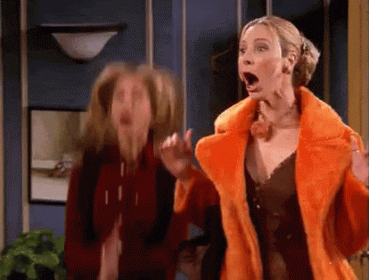 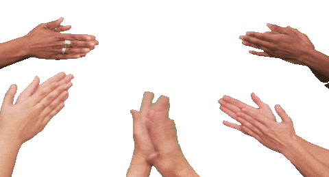 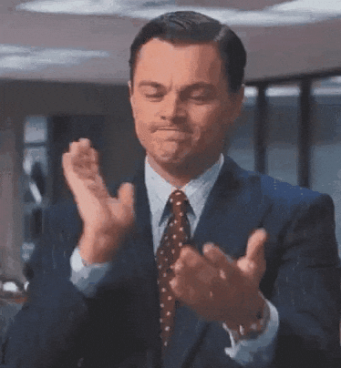 .imgref[[Images: [giphy](https://giphy.com/explore/clapping-hands-stickers)]]]

???

* let students think for a moment and then collect answers

Pipeline
* **Source**
* **Capture / Encode**
* **Transform / Model**
* **Third space**

Third Space
* Operational ↔ Experiential? Experiential 
* Deterministic ↔ Generative? Generative 
   
* **System setup** (structure and dynamics)
* **Influence** (feedback)
* **Meaning** (interpretation)

---
## Cataloging Translations and Spaces

**Pipeline**
* Source
* Capture / Encode
* Transform / Model
* Third space

**Third Space** 
* System setup (structure and dynamics)
* Influence (feedback)
* Meaning (interpretation)

???
* Operational ↔ Experiential? Experiential 
* Deterministic ↔ Generative? Generative 
  

---
.header[Cataloging Translations and Spaces]

## Example: *Clapping*

> Tech: Each clap spawns or perturbs a population of moving particles.  
  
???
  
Clapping → Particle Population
  

--
  
Pipeline:  
  

--

* **Source**: Human clapping

--

* **Capture / Encode**: Microphone detects clap onsets, tempo, and intensity

???
* Clap onset is detected by finding sudden spikes in sound energy, which indicate the moment a clap occurs.
* Intensity is estimated from the signal amplitude. Louder claps produce higher energy values.
* Tempo is calculated from the time intervals between successive clap onsets.

The result is a small set of values such as event time, loudness, and rhythm, which are then used to control parameters of the particle system. In other words, the system does not recognize “clapping” as such. It receives timed impulses with measurable strength that perturb the simulated world.

--

* **Transform / Model**: Within a particle system, claps generate new particles, alter their velocity, or switch system states depending on rhythm patterns

--

* **Third space**: You are part of an ecology that grows, swarms, or collapses
  
  

---
.header[Cataloging Translations and Spaces]

## Example: *Clapping*

Clapping → Particle Population

???
* Operational ↔ Experiential? Experiential ✓
* Deterministic ↔ Generative? Generative ✓

--

* System setup: **some**
    * Particle system that represents an ecological organism
    * Entities: particles, clusters, attractors, decay thresholds
    * Rules: a single clap may create particles, repeated claps may attract them into swarms, silence may let them dissolve
    * The system develops collective motion patterns not contained in any one clap

---
.header[Cataloging Translations and Spaces]

## Example: *Clapping*

Clapping → Particle Population

* Influence: **some**
    * Participants experiment with rhythm to discover how the ecology responds
    * The system encourages strategic and playful behavior, such as sustaining or destabilizing populations

---
.header[Cataloging Translations and Spaces]

## Example: *Clapping*

Clapping → Particle Population

* Meaning: **weak**
    * Reframes clapping as ecological intervention
    * Suggests that repeated simple actions can generate complex collective behavior

???

Clapping becomes population control: short percussive events seed and disturb an evolving particle ecology with its own collective dynamics.

---
.header[Cataloging Translations and Spaces]

## Example: *Clapping*

> Clapping becomes population control: each clap seeds or disturbs particles in a playful generative ecology whose dynamics extend beyond any single clap, inviting experimentation while only loosely reframing clapping as human intervention in ecology.
  

--
  

Focus: audiovisual design and **appealing aesthetics** (think *Nature Dreams*).

---
.header[Cataloging Translations and Spaces]

## Example: *Clapping*

> Concept: In reference to contemporary social media platforms and attention as currency, the work expresses that only what receives applause is seen and survives, the material receiving little attention fades from existence.

--

→ Clapping as form of attention currency

--

 

> Start with the concept and world building...

???
where visibility is determined by likes, views, and engagement spikes.

---
.header[Cataloging Translations and Spaces]

## Example: *Clapping*

World building:

???
The system opens with a slowly drifting view of a complex visual world. As the camera moves, it zooms into different scenes: political debates, celebrity events, environmental crises, scientific discoveries, everyday life. Each scene exists as a small island within the larger landscape.

When the camera approaches a scene, the audience’s clapping is captured. Applause increases the scene’s visibility. It grows brighter, multiplies into variations of itself, and begins to dominate the surrounding space. Scenes that receive little response gradually fade, shrink, or dissolve.

As the system continues to move through the world, attention reshapes the landscape. Some topics expand into overwhelming spectacles while others quietly disappear.

Over time the audience realizes they are not just observing the world. Through applause, they are selecting which parts of it remain visible.

--

* Overview of a large, detailed visual world

--

* Sequence of zooms into different scenes from society
* Scenes have different visual representations

???
* Politics, science, entertainment, everyday life
* From flashy to to detailed and beautiful but monochromatic etc.

--

* When the camera approaches a scene, the audience’s clapping is captured

--

* Strong applause increases the scene’s visibility, little clapping makes them slowly fade, shrink, or disappear

???
It grows brighter, multiplies, and becomes more spectacular.

--

* Over time the landscape is shaped entirely by audience attention

???

* The audience realizes their applause determines what remains visible in the world.

???

---
.header[Cataloging Translations and Spaces]

## Example: *Clapping*

Clapping → Attention Currency

 

Pipeline:

--

* **Source**: Human clapping

--

* **Capture / Encode**: Microphone detects clap onsets, tempo, and intensity

--

* **Transform / Model**: Applause is translated into an attention score that controls the visibility, replication, or decay of scenes

--

* **Third space**: A dynamic media landscape where scenes compete for attention

---
.header[Cataloging Translations and Spaces]

## Example: *Clapping*

Clapping → Attention Currency

???
* Operational ↔ Experiential? Experiential ✓
* Deterministic ↔ Generative? Generative ✓

--

* System setup: **some**
    * A procedural media landscape composed of multiple scenes
    * **Entities**: scenes, visibility and attention scores, replication rules, decay functions
    * **Rules**: clapping mapped to the *attention score*; the scene is re-rendered each frame based on current scores for each scene
    * The world evolves constantly

???
as attention redistributes visibility across scenes

---
.header[Cataloging Translations and Spaces]

## Example: *Clapping*

Clapping → Attention Currency

* Influence: **strong**
    * The audience actively determines which scenes remain visible
    * Collective applause amplifies certain topics while others disappear

---
.header[Cataloging Translations and Spaces]

## Example: *Clapping*

Clapping → Attention Currency

* Meaning: **strong**
    * The system exposes how attention economies privilege spectacle and engagement
    * What receives attention expands, while other topics quietly vanish
    * The need to attention is constant

???

* Applause becomes a metaphor for algorithmic visibility

---
.header[Cataloging Translations and Spaces]

## Example: *Clapping*

> Clapping becomes part of an attention economy: scenes that receive applause dominate the landscape, while those less recognized slowly fade from the world.
  

--
  

Focus: conceptual and **meaning making** (think *Superradiance*).

???

Open questions: why should the audience clap in the first place?

---
## Designing Translational Media and World-Building

> Where to start, conceptually or with a technical pipeline?

--

* Up to you, the task, the environment etc. 
  
--
  
 

*However:* The pipeline and third space properties are always present!

--

> The question is whether you design them deliberately or not.

---
.header[Designing Translational Media and World-Building]

 
Pipeline
* **Source**
* **Capture / Encode**
* **Transform / Model**
* **Third space**

--

Third Space
* **System setup** (structure and dynamics)
* **Influence** (feedback)
* **Meaning** (interpretation)

---
template:inverse

# Pipeline Ideas?

???

Pipeline
* **Source**
* **Capture / Encode**
* **Transform / Model**
* (Third space)

* collect student input

---
.header[Cataloging Translations and Spaces]

## Pipeline Ideas

Pipeline
* **Source**
* **Capture / Encode**
* **Transform / Model**
* **Third space**

???
* Use any analog data to virtual one, be it technical or conceptual
* Which analog data to use, which encoding, with transforming which third spaces

---
template:inverse

# Cataloging Translations

---
.header[Cataloging Translations and Spaces | Pipeline Ideas]

## Gesture Capturing

--

* **Source**: Human body movement  

--

* **Capture / Encode**: Depth camera, optical mocap, or ML pose estimation producing joint coordinates and motion vectors  

--

* **Transform / Model**: Motion features drive simulations, generative rules, or spatial forces  

--

* **Possible Third Spaces**: Fluid environments where gestures become currents, particle ecologies responding to movement, dynamic light fields shaped by choreography, social media feeds

---
.header[Cataloging Translations and Spaces | Pipeline Ideas | Gesture Capturing]

.center[].imgref[[Image: Memo Akten and Katie Hofstadter. 2025. Superradiance. https://superradiance.net/]]

---
.header[Cataloging Translations and Spaces | Pipeline Ideas]

## Voice and Sound

--

* **Source**: Human voice, speech, or environmental sound  

--

* **Capture / Encode**: Microphone extracting amplitude, pitch, spectral features, and rhythm  

--

* **Transform / Model**: Audio features mapped to generative systems or behavioral rules  

--

* **Possible Third Spaces**: Collective music score compositions, Swarms that react to rhythm and loudness, weather systems driven by sound energy, visual ecosystems growing from harmonic structure

---
.header[Cataloging Translations and Spaces | Pipeline Ideas | Voice and Sound]

## *Utooto* (Yuri Suzuki, 2025)

--

> A participatory installation where visitors interact with pipes and horns to shape how sound travels through a large architectural structure, creating a collective “sonic architecture.”

---
.header[Cataloging Translations and Spaces | Pipeline Ideas | Voice and Sound]

## *Utooto* (Yuri Suzuki, 2025)

.center[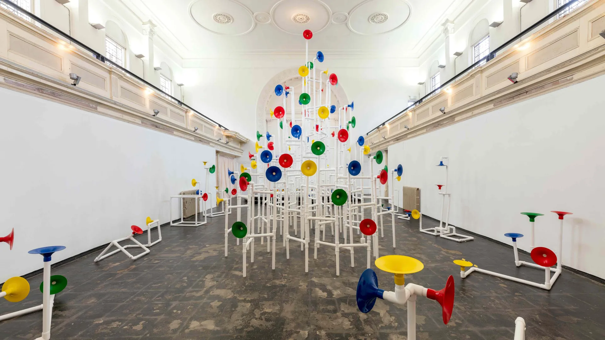 .imgref[[Image: [Wallpaper](https://www.wallpaper.com/design-interiors/design-events/yuri-suzuki-camden-arts-projects?utm_source=chatgpt.com)]]]

???
Alongside the sound of visitors, a generative soundtrack plays softly through hidden speakers in pipes. Made from a library of vowels and consonants that are common across global languages, the sounds are composed in a way that sometimes resembles spoken language. ‘It may feel familiar, like you’re hearing a language you know, though it’s from nowhere in particular,’ explains Suzuki.

---
.header[Cataloging Translations and Spaces | Pipeline Ideas]

## Image / Camera Input

--

* **Source**: Live camera feed or photographs  

--

* **Capture / Encode**: Computer vision processing or feature embeddings extracted from images  

--

* **Transform / Model**: Dimensionality reduction, clustering, or generative synthesis  

--

* **Possible Third Spaces**: Navigable latent landscapes of visual similarity, Abstract simulations, Data sculptures evolving from image statistics, Morphing environments generated from visual memory or historical features

---
.header[Failure Modes in Generative AI | Perception]
## *Hyperface* (Adam Harvey, 2016)

.center[ .imgref[[Image: [adam.harvey.studio](https://adam.harvey.studio/hyperface/)]]]

???

* Hyperface uses decoy face-like features across fabric and surfaces to overload face detectors.
* Detectors respond strongly to certain feature combinations (eye-like shapes, contrast patterns), so the pattern creates many competing “face candidates.”
* The system’s decision logic becomes visible: it is not “seeing a face,” it is firing on features and thresholds.

Together, the examples show that misclassification can be engineered at the boundary between perception and decision, and that boundary is politically meaningful because it determines who becomes machine-visible in the first place.

---
.header[Cataloging Translations and Spaces | Pipeline Ideas | Image / Camera Input]

## *Adversarial Fashion* (Kate Rose, 2019)

.center[ .imgref[[Image: [DeepLearning.AI - The Batch](https://www.deeplearning.ai/the-batch/this-shirt-hates-surveillance/)]]]

???
* The garment acts as a physical adversarial example: the garment is optimized against object detection models (YOLO, etc.) — often targeting “person” class specifically
* The perturbation is not random noise. It is a structured texture that shifts the image’s feature representation across a boundary, so “person” becomes “not-person” or becomes unstable.
* The key residual is a gap between human perception (clearly a person) and machine perception (classification flips).

---
.header[Cataloging Translations and Spaces | Pipeline Ideas]

## Proximity and Spatial Position

--

* **Source**: Positions of people or objects in space  

--

* **Capture / Encode**: Computer vision tracking, LiDAR, or Bluetooth spatial sensing  

--

* **Transform / Model**: Agent-based simulation or spatial dynamics, forces

--

* **Possible Third Spaces**: Force fields showing attraction and avoidance, Swarm behaviors generated by crowd movement, Network diagrams that grow and dissolve in real time, Urban traffic-like flow simulations

---
.header[Cataloging Translations and Spaces | Pipeline Ideas | Proximity and Spatial Position]

## *Rain Room* (Hannes Koch and Florian Ortkrass, 2012)

--

> Visitors walk through a room where rain continuously falls, but motion-tracking cameras detect their position and stop the rain directly above them, allowing them to move through the storm without getting wet.

.footnote[[[Wikipedia - Rain Room](https://en.wikipedia.org/wiki/Rain_Room)]]

---
.header[Cataloging Translations and Spaces | Pipeline Ideas | Proximity and Spatial Position | *Rain Room* (Hannes Koch and Florian Ortkrass, 2012)]

.center[
 <video width="900" controls>
  <source src="./img/cataloging/rainroom_cutout_01.webm" type="video/webm">
</video>  
]

.footnote[[[*Rain Room* (Hannes Koch and Florian Ortkrass, 2012)](https://www.random-international.com/rain-room)]]

---
.header[Cataloging Translations and Spaces | Pipeline Ideas]

## Environmental Sensors

--

* **Source**: Ambient conditions such as temperature, light, or humidity  

--

* **Capture / Encode**: Sensor arrays converting environmental signals into numeric values  

--

* **Transform / Model**: Procedural simulations driven by environmental parameters  

--

* **Possible Third Spaces**: Climate systems with storms and wind patterns, Abstractions, Slowly evolving ecosystems and generative landscapes, Long-duration installations reflecting environmental change

---
.header[Cataloging Translations and Spaces | Pipeline Ideas | Environmental Sensors]

## *The Biosphere* (Sylvia Rybak, Urszula Przybylska, 2024)

--

> Critique of techno-utopian “exit” fantasies of isolated, self-sustaining colonies by revealing the fragility and unpredictability of such supposedly perfect artificial worlds.

???
The Biosphere is an interactive installation that simulates a closed ecological habitat inspired by the Biosphere-2 project and visions of space colonization. Using Unreal Engine and environmental sensors (measuring oxygen, humidity, light, and temperature), the work generates evolving digital ecosystems that visually respond to subtle changes in the surrounding environment. Conceptually, it critiques techno-utopian “exit” fantasies of isolated, self-sustaining colonies by revealing the fragility and unpredictability of such supposedly perfect artificial worlds.

The Biosphere 2 project (1991–1994) was a large-scale experiment in Arizona that attempted to create a sealed artificial ecosystem where humans could live self-sufficiently, testing whether a closed ecological system could support life for future space colonization.

------

The installation is inspired by the Biosphere-2 project and aims to simulate an ecosystem and a human living environment comparable to, or even superior to, Earth’s natural environment. The installation was developed using the Unreal Engine, which is known for its high degree of realism and real-time interactivity. Sylvia Rybak made a significant contribution to the technical implementation. Her responsibilities included developing algorithms for sensors that trigger state changes within the simulation, as well as overseeing the visual and design elements of the scene.

Particularly noteworthy is the innovative form of data visualization developed within the project. Unlike conventional, abstract representations such as bar charts or scatter plots, the sensor data is visualized through highly aesthetic, three-dimensional representations of plants and habitats. The visual environments dynamically change under the influence of the sensor data, creating an atmosphere that aesthetically evokes the Garden of Eden. A fascinating interplay of contrasts emerges, traversing the dichotomies of nature and artificiality, realism and distortion, as well as beauty and unease. From the perspective of visualization research, this is remarkable, as the installation goes far beyond conventional forms of visualization and transforms data into an aesthetically sophisticated, interactive artwork.

---
.header[Cataloging Translations and Spaces | Pipeline Ideas | Environmental Sensors]

.center[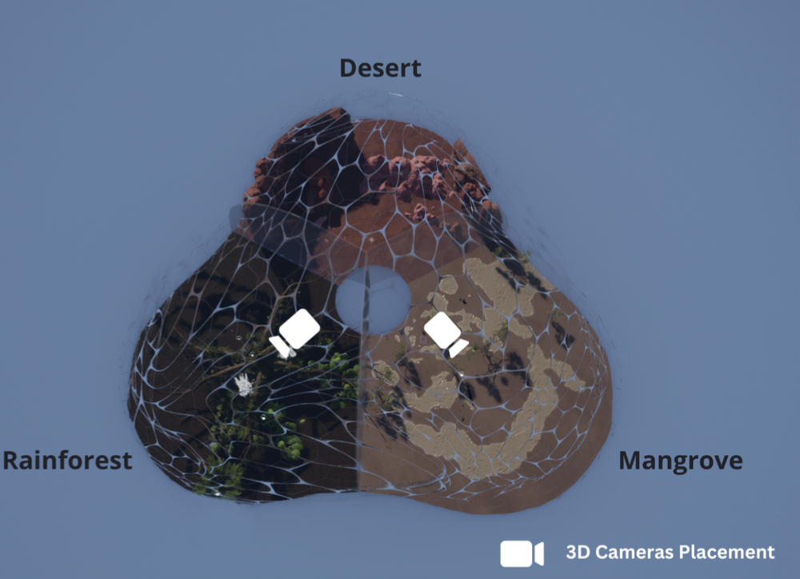]
.footnote[[*The Biosphere* (Sylvia Rybak, Urszula Przybylska, 2024)]]

---
.header[Cataloging Translations and Spaces | Pipeline Ideas | Environmental Sensors]

.center[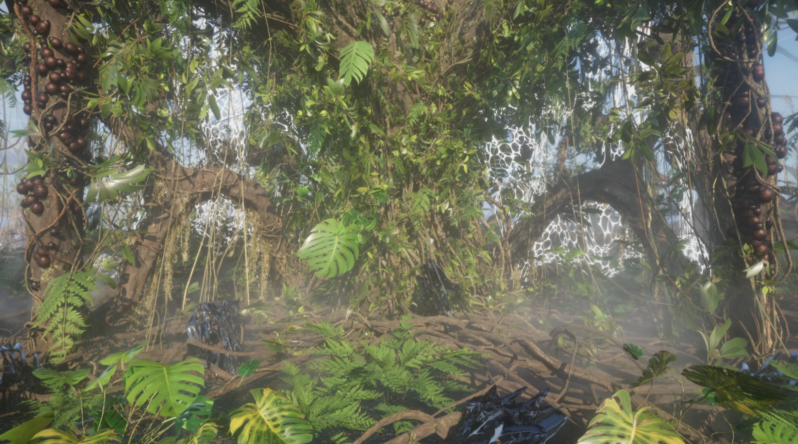 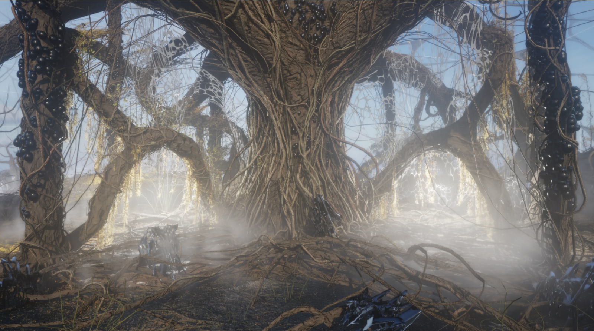]
.footnote[[*The Biosphere* (Sylvia Rybak, Urszula Przybylska, 2024)]]

---
.header[Cataloging Translations and Spaces | Pipeline Ideas | Environmental Sensors]

.center[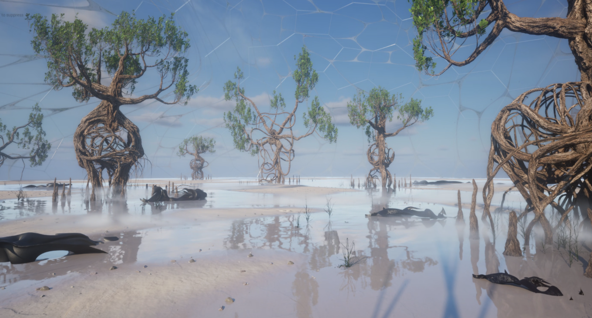  
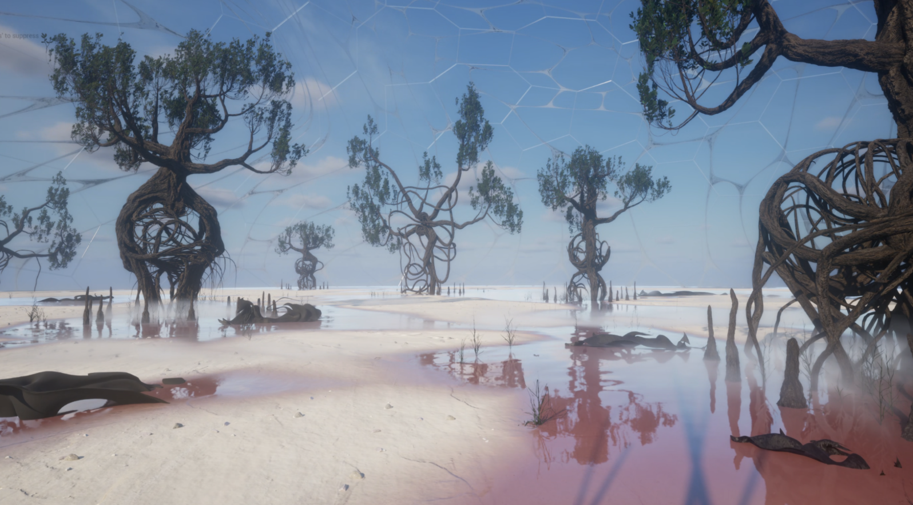  
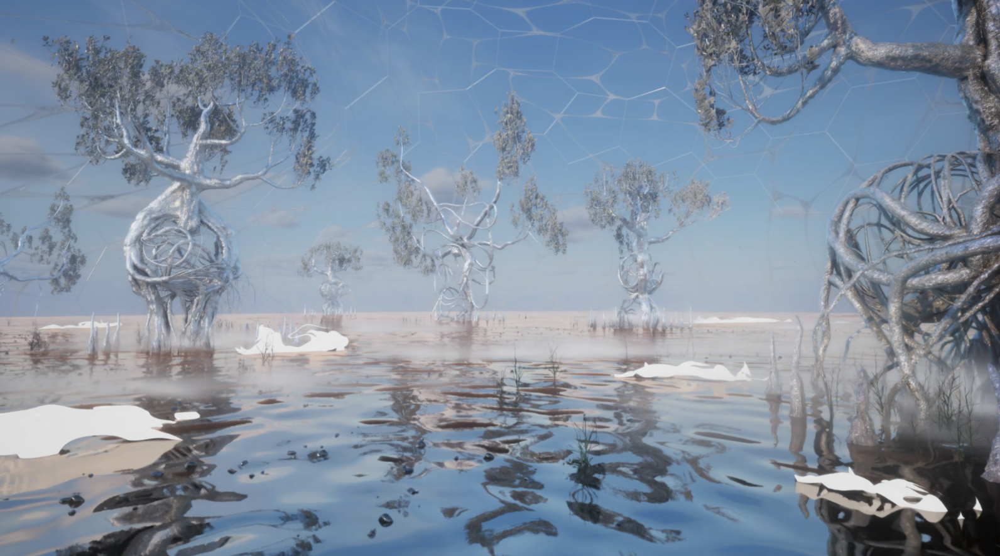]
.footnote[[*The Biosphere* (Sylvia Rybak, Urszula Przybylska, 2024)]]

---
.header[Cataloging Translations and Spaces | Pipeline Ideas]

## Biometric Signals

--

* **Source**: Physiological signals such as heart rate or brain activity  

--

* **Capture / Encode**: Wearables measuring heart rate, EEG, or galvanic skin response  

--

* **Transform / Model**: Temporal generative processes linked to biometric rhythms  

--

* **Possible Third Spaces**: Pulsating audiovisual organisms or environments, Generative sculptures breathing, Collective biofeedback landscapes

---
.header[Cataloging Translations and Spaces | Pipeline Ideas | Biometric Signals]

### *Pulse Room* (Rafael Lozano-Hemmer, 2006)

.center[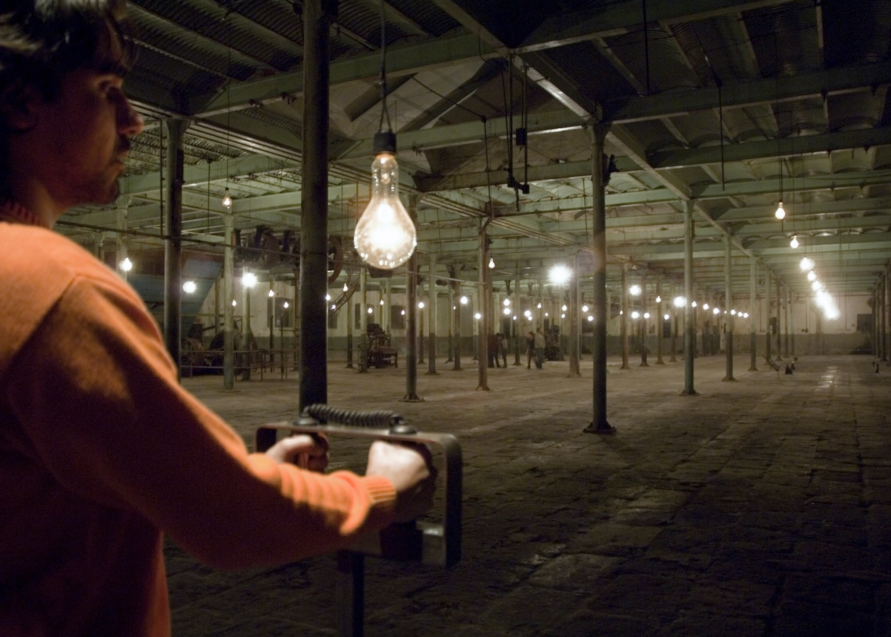]
.imgref[[[Smithsonian, Hirshhorn](https://hirshhorn.si.edu/exhibitions/rafael-lozano-hemmer-pulse/)]]

---
.header[Cataloging Translations and Spaces | Pipeline Ideas]

## Text and Language

--

* **Source**: Written or spoken text

--

* **Capture / Encode**: Natural language processing producing semantic embeddings or topic vectors  

--

* **Transform / Model**: Topic clustering, narrative generation, or semantic translation  

--

* **Possible Third Spaces**: Data visualization, Narrative ecosystems where stories interact, Semantic landscapes where meaning becomes geography, AI-generated environments evolving from text prompts, Conversational worlds populated by language-driven agents

---
.header[Cataloging Translations and Spaces | Pipeline Ideas | Text and Language]

## *A.I. Interprets A.I. Interpreting ‘Against Interpretation’ (Sontag 1966)* (Jake Elwes, 2023)

---
.header[Misalignment as Medium | *A.I. Interprets A.I. Interpreting ‘Against Interpretation’ (Sontag 1966)* (Jake Elwes, 2023)] 

.center[ ]  
.footnote[[[*(Sontag 1966)*](https://www.jakeelwes.com/project-sontag.html), Jake Elwes, 2023.]]

---
.header[Cataloging Translations and Spaces | Pipeline Ideas | Text and Language]

## *A.I. Interprets A.I. Interpreting ‘Against Interpretation’ (Sontag 1966)* (Jake Elwes, 2023)

* Sontag’s sentences are used as prompts in a diffusion image model
* The generated images are re-captioned using CLIP-guided text generation with GPT-2
* Output text becomes a machine re-interpretation of the original sentence

???
**translation chain / cross-modal misalignment**
* Large pre-trained models are trained on internet-scale datasets
* Sontag’s precise theoretical language is processed through systems shaped by broad, biased data
* Text → Image → Text introduces compounding reinterpretation

The residual appears in the gap between Sontag’s intent and the machine’s associations.  
They filter her writing through internet-scale priors.  
  
They reflect what the models statistically associate with her words.

* Diffusion image model: Disco Diffusion
* Captioned using CLIP + GPT-2
* Output text becomes a machine re-interpretation of the original sentence

-----

An AI is made to visually interpret Susan Sontag’s seminal essay ‘Against Interpretation’, and then another AI surreally interprets those images back into language.

Sontag writes in ‘Against Interpretation’ about her dislike of critics over-interpreting works of art, how we read too much into content and meaning over just experiencing the work of art and it’s form. In this video however we have an AI nonsensically reading too much into Sontag’s words, this also has additional prescience since the generative AI is arguably (uninterpretable,) creating pure mimesis and form since it is devoid of any human artist’s intentionality, meaning or content.

The visuals are created with an image generating diffusion model with Sontag’s sentences as its raw prompts / inputs (open-source Disco Diffusion thanks to Somnai & Katherine Crowson). These images are then interpreted back into language using an image labelling algorithm (GPT2 & CLIP). These large pre-trained AI models were created using huge datasets of images and text taken from the internet representing a frozen snapshot of a biased section the internet a particular point in time. The re-interpretations are bizarre in how authoritatively and brazenly they seem determined on spreading disinformation. 

---
.header[Cataloging Translations and Spaces | Pipeline Ideas | Text and Language | *A.I. Interprets A.I. Interpreting ‘Against Interpretation’ (Sontag 1966)* (Jake Elwes, 2023)] 

.center[
 <video width="960" controls>
  <source src="./img/cataloging/sonntag_cutout_01.webm" type="video/webm">
</video>  
]

.footnote[[[*(Sontag 1966)*](https://www.jakeelwes.com/project-sontag.html), Jake Elwes, 2023.]]

---
.header[Cataloging Translations and Spaces | Pipeline Ideas]

## Data Collections and Streams

--

* **Source**: Large-scale datasets such as audiovisual representations, financial data, social media, or climate records  

--

* **Capture / Encode**: APIs and data pipelines transforming raw data into structured features  

--

* **Transform / Model**: Statistical modeling, generative AI, or simulation frameworks  

--

* **Possible Third Spaces**: Data-driven immersive environments, Economic or political landscapes evolving over time, Generative visualizations revealing hidden patterns, Abstract data ecologies

---

.header[Cataloging Translations and Spaces | Pipeline Ideas | Data Collections and Streams]

## *Zizi* (Jake Elwes, 2019-2022)

.footnote[[[*Zizi*](https://www.jakeelwes.com/), Jake Elwes, 2019-2022.]]

---
.header[Misalignment as Medium | *Zizi* (Jake Elwes, 2019-2022)]

.center[ ]  
.footnote[[[*Zizi*](https://www.jakeelwes.com/), Jake Elwes, 2019-2022.]]

---
.header[Cataloging Translations and Spaces | Pipeline Ideas | Data Collections and Streams]

## *Zizi* (Jake Elwes, 2019-2022)

* Starts from a pretrained face-generating GAN trained on datasets shaped by dominant gender and racial priors
* Fine-tuning of the model with a curated dataset of drag performers, introducing aesthetics and identities outside the training data
* The model struggles to stabilize facial identity, revealing bias in what it learned as “face”

.footnote[[[*Zizi*](https://www.jakeelwes.com/), Jake Elwes, 2019-2022.]]

???
Layer chosen: **training data assumptions**

Technically, the process is roughly:
* Start from an existing face-generating GAN architecture (e.g. StyleGAN).
* Fine-tune or retrain it on a curated dataset of drag performers.
* Sometimes also filter or bias the training set to foreground specific identities and aesthetics.
* Generate portraits from the trained model’s latent space.

Elwes does not treat instability as noise.
He selects a dataset that the model’s priors cannot comfortably resolve.

The breakdown exposes:
- what the system expects a face to be
- what counts as legible
- what is treated as deviation

The failure is testimony.

---
.header[Cataloging Translations and Spaces | Pipeline Ideas | Data Collections and Streams]

.center[
 <video width="960" controls>
  <source src="./img/cataloging/zizzi_cutout_02.webm" type="video/webm">
</video>  
]

.footnote[[[*Zizi*](https://www.jakeelwes.com/), Jake Elwes, 2019-2022.]]

---
template:inverse

### *The source does not determine the world,...*

--

### *..the translation does.*

???
The same input can lead to many different spaces.
When building a system, you are deciding:

* what counts as signal  
* what is ignored as noise  
* what entities exist in the system  
* what behaviors the world can produce  

Every pipeline constructs a world. The question is not whether we build worlds.

---
template:inverse 

# *The End*

### Prof. Dr. Lena Gieseke | l.gieseke@filmuniversitaet.de  

#### Film University Babelsberg KONRAD WOLF
