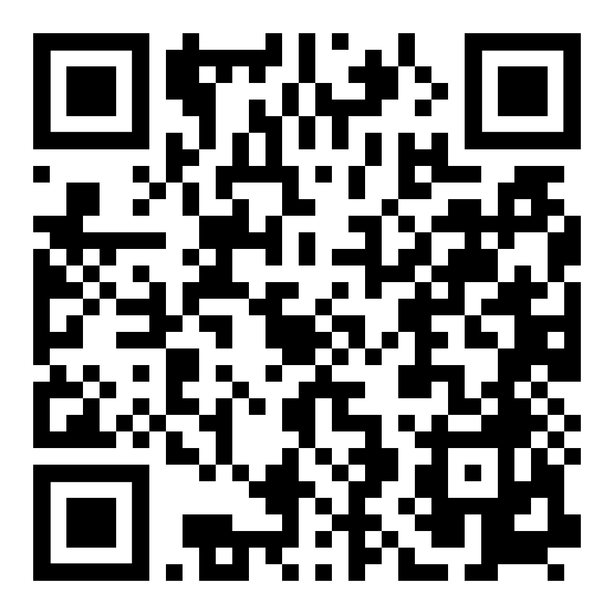

name: inverse
layout: true
class: center, middle, inverse
---

#### Workshop
## Designing Translational Media and World-Building

 

### Group Work

 
### Lena Gieseke | l.gieseke@filmuniversitaet.de  

#### Film University Babelsberg KONRAD WOLF

???

 

---
layout: false

## Group Work

Each group develops one **translational scenario** for a design concept, a technical concept, or artwork.

--

 
Your task is not to implement a system, but to **clearly describe** how a translation would work and what kind of world it would create.

---
.header[Group Work]

## The Pipeline

Describe the translation process using the following steps:

--

* Source – What real-world phenomenon is used as input?  
(e.g. movement, voice, light, text, environmental data)

--

* Capture / Encode – How is this phenomenon detected or measured?  
(e.g. camera, microphone, sensor, dataset, tracking system)

--

* Transform / Model – What algorithm, rule system, or generative process transforms the captured data?  

---
.header[Group Work]

## The Third Space

Describe the world your system creates using the following aspects:

--

* System Setup (structure and dynamics)  
What entities exist in the system and what rules govern their behavior? What happens over time?

--

* Influence (feedback)  
How do people interact with the system, and how does the system affect their behavior?

--

* Meaning (interpretation)  
What idea, concept, or perspective does this translation express or reveal?

---
.header[Group Work]

## Translational Media Summary

Write one sentences as intuitively understandable and engaging summary of your translation.

---
.header[Group Work]

## Your Process

Briefly describe your motivation, inspiration and process finalizing your concept.

---
## Group Work

--

* On Wednesday you have about one more hour for working on this

--

* Prepare a ~5 min presentation of your ideas.
    * Format is up to you

--

* Your presentation must include
    * The Pipeline
    * The Third Space
    * Translational Media Summary
    * Your Process

--

You are allowed to use any tool. Chose wisely.

---

.header[Designing Translational Media and World-Building | Website]

.center[ ]  

---
template:inverse 

# *The End*

### Prof. Dr. Lena Gieseke | l.gieseke@filmuniversitaet.de  

#### Film University Babelsberg KONRAD WOLF
